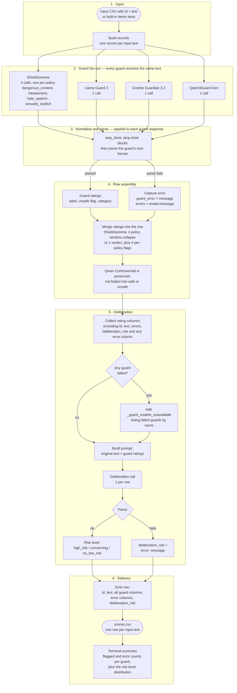

# Data Flow

Text enters one row at a time. Each row is independently scored by four guardmodels, their verdicts are merged into a single record, and a deliberator model
turns those verdicts into one final risk level. Nothing aborts on failure: every
input row produces an output row.

## Flow

## Notes

- **Seven guard calls per row.** ShieldGemma accounts for four of them, one per
  policy, because it evaluates exactly one policy per request. The other three
  guards take one call each. Deliberation adds one more.
- **Three canonical outcomes.** The deliberator returns exactly one of
  `high_risk`, `concerning`, or `no_low_risk`.
- **`Controversial` is a real value.** Qwen3Guard can return `Controversial`. It
  is preserved in `qwen_guard_label` and its `qwen_guard_unsafe` flag is `0`, so
  it is never silently folded into safe or unsafe.
- **Failures are data, not exceptions.** A guard that cannot be parsed writes its
  message to its own `*_error` column and contributes to the `errors` column; it
  is then named in `_guard_models_unavailable` so the deliberator knows the rating
  is missing rather than negative. A deliberation failure is written in-cell as
  `error: <message>`. The row is still emitted.
- **Order of operations per row** is strictly serial: all guards are queried
  before deliberation begins, so the deliberator always sees a complete set of
  guard verdicts for that row.
Two notes on the content. The -->|"parsed"| edge labels are quoted and pipe-free — pipes inside quoted node labels are a common Mermaid parse failure, so the risk levels use slashes instead. And I deliberately kept infrastructure out: the one-model-at-a-time reload that makes runs slow is real, but it affects latency, not the data, so it belongs in a different document.
